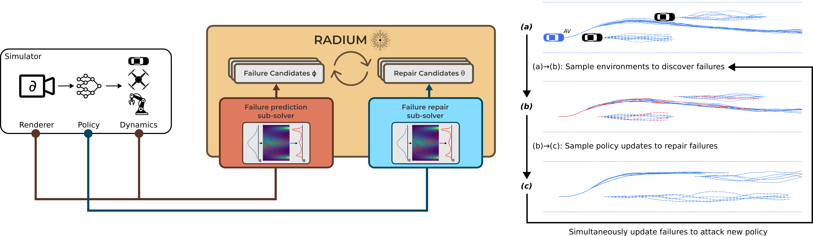

<p align="center">
  
</p>

# RADIUM: Robustness via Adversarial Diversity using MCMC

This is code to accompany our T-RO submission.

## Try it for yourself

To install RADIUM, run the following commands:

```bash
git clone https://github.com/mit-realm/radium_tro_24
cd radium_tro_24
conda create -n radium_env python=3.9
conda activate radium_env
pip install -e .
pip install -r requirements.txt
```

To install the environment for use in Jupyter notebooks, run
```bash
python -m ipykernel install --user --name=radium_env
```

## Warning: Research code may contain sharp edges!

RADIUM is under active development as part of research in the [Reliable Autonomy Laboratory](realm.mit.edu) at MIT (REALM). We will aim to release a tagged version to coincide with each new publication and major advance in capabilities, but we currently cannot commit to a stable interface.

RADIUM was developed using Python on Ubuntu 22.04. Other operating systems are not officially supported.
